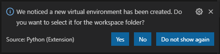
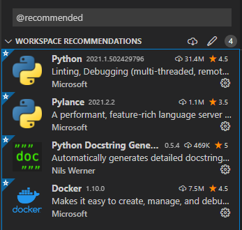

## Requirements:
- Python 3.9
- Poetry

## Installation:
- Install Python
- Install Poetry https://python-poetry.org/docs/
  - macOS / Linux: `curl -sSL https://raw.githubusercontent.com/python-poetry/poetry/master/get-poetry.py | python -`
  - Windows: `(Invoke-WebRequest -Uri https://raw.githubusercontent.com/python-poetry/poetry/master/get-poetry.py -UseBasicParsing).Content | python -`

## Python dependency setup:
To install Python dependencies:
- Run “poetry install” in both the “frontend” and “backend” directory.

## VSCode workspace:
To get a preconfigured VSCode workspace with recommended settings:
- Open “Honeypot.code-workspace” with VSCode.
- Install the recommended extensions below.
- If this shows up, press NO and restart the editor (else you will edit the shared workspace config).

- If everything works as expected, `Python 3.x.x 64-bit ('.venv')` should be displayed in the bottom left corner of the editor and linting should work in `.py` files.

## Recommended extensions:
When the workspace has been opened in VSCode it will ask you to install recommended extensions. For easier coding we recommend you to add these.

## How to run frontend or backend for development:
- Run `docker-compose up --build` in either the `frontend` or the `backend` folder.
- (Remove `--build` if you wish to not rebuild container each time)